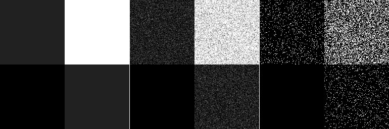

# Sampler2D
Utilitary class for efficiently sampling discrete 2D distributions.

Monothreaded but could very easily made parallel.

Written in C++11.

# Method
It uses the inverse transform sampling method twice.

First the provided data is preprocessed :
* first compute the column vector of each line's weight (summed line values)
* then normalize each line from the provided distribution

To generate a sample:
* generate r1 in [0,1], use inverse transform sampling on the column vector to determine the line
* generate r2 in [0,1], use the inverse transform method on the selected line.

# Results
On a laptop, with float precision and with a 1024x1024 pixels distribution, this class generates 460000 samples / second.

Below are the results for a 256x256 and a 2x2 distributions. Left is the distribution, middle the blended results, right the raw results.

